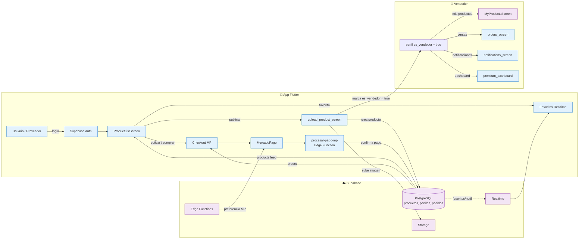

# 🛒 Marketplace Local Chile

---

**Plataforma e‑commerce híbrida (web, iOS, Android)** que conecta a **vendedores, productores y emprendedores locales de Chile** con clientes de su misma zona, eliminando barreras digitales y potenciando la economía circular.

🔗 **[Ver demo en vivo →](https://marketplace-productos-locales.vercel.app/)**

---

## El problema y la solución

**El problema**  
En Chile, miles de pequeños productores y emprendedores no tienen visibilidad digital ni canales eficientes para llegar a compradores cercanos. Dependen de redes sociales o plataformas genéricas que no están diseñadas para su contexto local.

**La solución**  
Creamos un marketplace donde:
- Los **vendedores** registran su catálogo, definen su zona de cobertura y gestionan pedidos.
- Los **compradores** descubren productos por geolocalización o región, y pueden comprar o cotizar en minutos.
- El sistema integra **pagos digitales seguros** (Mercado Pago) y **validación de identidad** (RUT chileno).

---

## 🏗️ Arquitectura y flujo de datos

El proyecto sigue una arquitectura **BaaS (Backend as a Service)** con Supabase, garantizando alta disponibilidad, sincronización en tiempo real y seguridad granular.

Características técnicas destacadas
Área	Implementación
Geolocalización	Consultas geoespaciales con geolocator + geocoding para filtrar productos por radio de entrega.
Seguridad y RLS	Políticas estrictas en PostgreSQL que aíslan datos por usuario/productor; funciones SECURITY DEFINER con search_path fijo.
Procesamiento edge	Edge Functions en Deno para lógica crítica (validación de RUT, gestión de pagos).
Pasarela de pago	Flujo síncrono/asíncrono con Mercado Pago + soporte de Deep Links (App Links) para retorno transaccional.
Validación local	Algoritmo personalizado de sanitización y validación del RUT chileno.
Publicidad	Integración opcional con Google Mobile Ads (rendimiento controlado).
Seguridad (resumen)
RLS en PostgreSQL: aislamiento completo por usuario/proveedor.

Funciones SECURITY DEFINER con search_path fijo y permisos revocados.

Pagos en dos capas:

Verificación de firma HMAC‑SHA256 del webhook.
Re-consulta directa a la API oficial de Mercado Pago antes de confirmar la transacción.
📄 Revisa la auditoría de seguridad completa en SECURITY_AUDIT.md.

🛠️ Stack tecnológico
Frontend
Core: Flutter (Dart) – compilación nativa para alto rendimiento.

Geolocalización: geolocator y geocoding.

Optimización: cached_network_image para caché de imágenes y ahorro de ancho de banda.

Navegación: soporte de enlaces universales (App Links / Deep Links).

Backend e infraestructura
Motor: PostgreSQL (Supabase Cloud).

Serverless: Deno / Edge Functions (TypeScript).

Storage: Supabase Storage con políticas RBAC.

Monetización: Google Mobile Ads (integración asíncrona).

⚙️ Configuración del entorno de desarrollo
Prerrequisitos
Flutter SDK (última versión estable) – instalación

Cuenta activa en Supabase y proyecto creado – guía

(Opcional) Supabase CLI para pruebas locales de Edge Functions

Pasos para ejecutar localmente
Clonar el repositorio

bash
git clone git@github.com:NicolasBruna24/marketplace-productos-locales.git
cd marketplace-productos-locales
Instalar dependencias

bash
flutter pub get
Configurar variables de entorno
Copia env.json.example a env.json y completa tus credenciales:

json
{
  "SUPABASE_URL": "https://tu-proyecto.supabase.co",
  "SUPABASE_ANON_KEY": "tu-clave-anon-publica"
}
(El archivo está en .gitignore y se carga con --dart-define-from-file)

Ejecutar la aplicación

bash
# Para Android / iOS
flutter run --dart-define-from-file=env.json

# Para navegador (debug)
flutter run -d chrome --dart-define-from-file=env.json
Limitaciones y próximos pasos
Limitación actual	Plan de mejora
Pagos por transferencia bancaria requieren verificación manual por parte del vendedor.	Automatizar confirmación mediante integración con API bancaria o scraping seguro (pendiente de estudio).
Los compradores no tienen un historial de pedidos propio (solo los vendedores ven los recibidos).	Añadir nueva política RLS y pantalla de “Mis compras” en la próxima iteración.
Contacto
Si el proyecto te parece interesante, tienes sugerencias o deseas colaborar, no dudes en escribirme.

LinkedIn: Nicolás Bruna Fuentealba

Correo: brunafuentealba@gmail.com

Agradecimientos
A la comunidad open‑source por las herramientas que hacen posible este proyecto.

A los emprendedores locales que inspiraron la solución.

Hecho con ❤️ en Chile 🇨🇱
